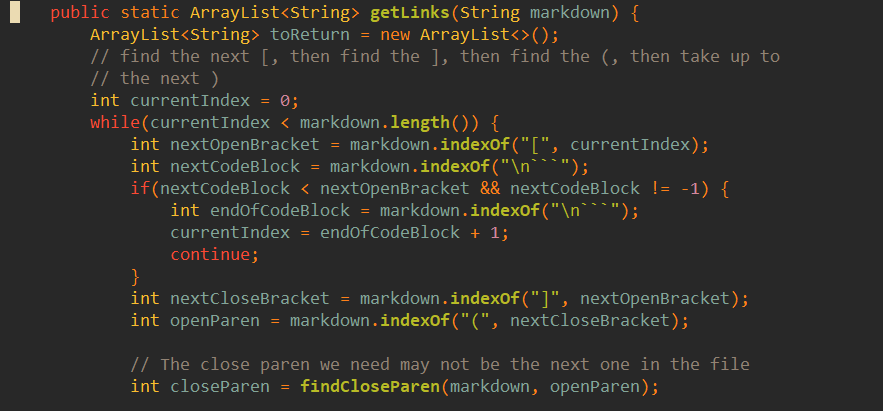

# How I found the difference in tests between my code and the provided code


First, I compiled my implementation as "MyMarkdownParse" (renamed the class inside the file itself). I also compiled the lab 9 implementation. 
Then, I moved the .class file to the same folder as the lab 9 implementation.
Once I had both of these files, I wrote this bash script:

```bash
files_dir=test-files
mine="MyMarkdownParse"
theirs="MarkdownParse"
test_results="test_results/"

all_md_files=$(ls ${files_dir}/*.md)
files_with_paren=$(grep "(" ${all_md_files} | grep -o ".*\.md\:" | grep -o ".*\.md")

cat /dev/null > ${test_results}TheirMarkdownParseResults.txt
cat /dev/null > ${test_results}MyMarkdownParseResults.txt
for i in $files_with_paren; do
    echo "$i: $(java $theirs $i)" >> ${test_results}TheirMarkdownParseResults.txt
done
for i in $files_with_paren; do
    echo "$i: $(java $mine $i)" >> ${test_results}MyMarkdownParseResults.txt
done
```

In this bash script, I filtered out the files without parentheses (no point in testing them, as there wouldn't be a link there). 
Then, I created two empty files that will hold the results of running MarkdownParse on each of these files. 
I appended to each of them the results of running MarkdownParse in the format of "file: result". Finally, I could view the differences in vimdiff. 

# Chosen tests

## 170.md

### Expected

An empty ArrayList

### Actual (mine)

An ArrayList with the following values:

* "demo"

### Actual (theirs)

An empty ArrayList (as expected)

### Reason

## 519.md

### Expected

An empty ArrayList

### Actual (mine)

An empty ArrayList (as expected)

### Actual (theirs)

An ArrayList with the following values:

* "uri1"

### Reason

This markdown file contains only an image, so it should be ignored. The provided code searches for text between brackets and then text between parentheses, and goes to the next line. It does this by getting the index of the first opening bracket, then the next closing bracket, then the next opening parentheses, then the next closing parentheses. In this case, it reads "[[foo]" as the text in brackets, and the attached link as "uri1". It then reads no more opening brackets and returns.

### Fix

First, there should be a function like findCloseParen, but for brackets. That would fix the issue of nested links. It should replace the current definition of nextCloseBrackets.
There should also be a check for exclamation marks in the beginning of this snippet. If there is an exclamation mark at an index exactly 1 less than the opening bracket, and it is not -1, the link should be skipped.



