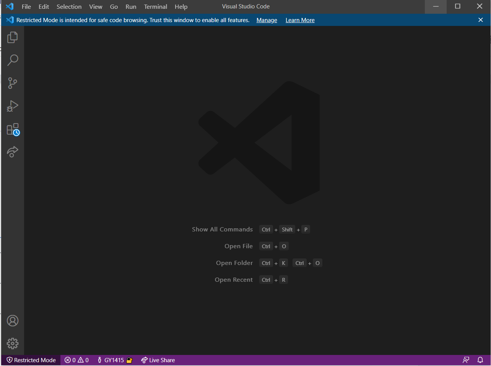
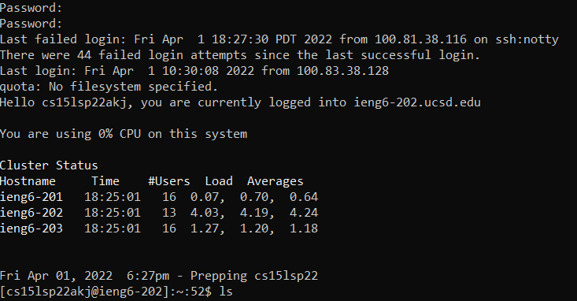
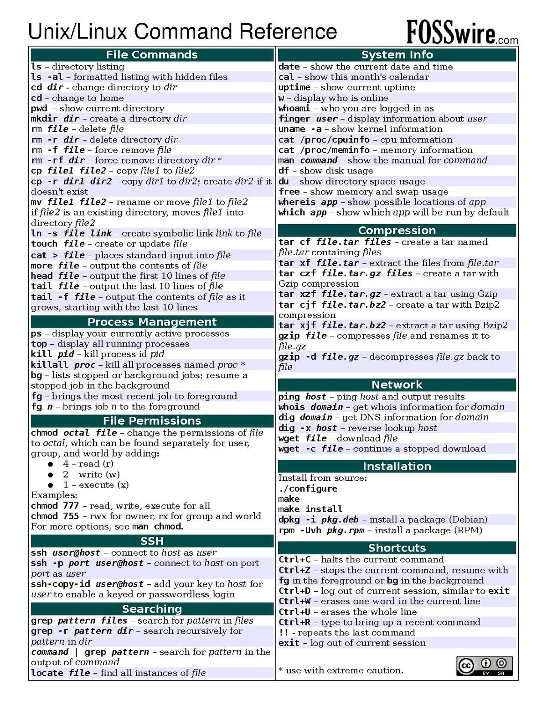
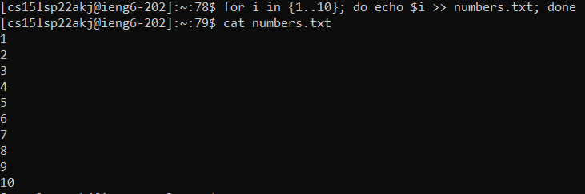
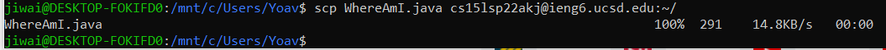
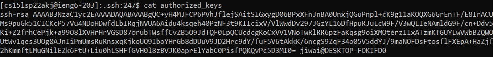
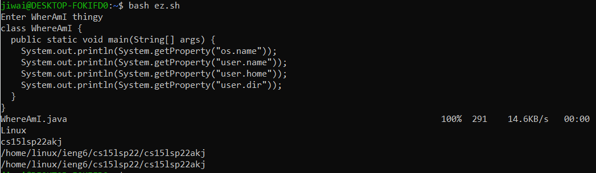

# Introduction

In this guide, I will show you how to complete the Week 1 lab. 
More specifically, I will show you how to do several things that are essential to being a programmer.

# How to install VScode

This one is pretty simple. Simply go to [this website](https://code.visualstudio.com/) and download the build for your operating system.

When installed, it should look like this:



# How to remotely connect to the server

You need to use a terminal, but you can use VS Code's if you want.

First, install OpenSSH by following the [instructions from Microsoft](https://docs.microsoft.com/en-us/windows-server/administration/openssh/openssh_install_firstuse). Alternatively, you can try to use the preinstalled ssh program which came with your operating system and try the instructions if it doesn't work.

Second, you need to search for your course-specific account. Use [this website](https://sdacs.ucsd.edu/~icc/index.php) to search for your account. Your account username should look something like "cs15lsp22**", where the asterisks are wildcards.

Once you've found your account, you'll need to reset your password. You can reset your password pretty easily by clicking on the cs15l account, and then clicking on the link in "you can __change your password__ for this account". The guidelines are pretty strict, so make sure you remember the password you use!

Now you can run an ssh command to connect to the server. The format is `ssh username@host`. Substitute 'username' for your username, and 'host' for 'ieng6.ucsd.edu'. In my case, `ssh cs15lsp22akj@ieng6.ucsd.edu`.

You should now see something like this:

```
$ ssh cs15lsp22zz@ieng6.ucsd.edu

The authenticity of host 'ieng6.ucsd.edu (128.54.70.227)' can't be established.
RSA key fingerprint is SHA256:ksruYwhnYH+sySHnHAtLUHngrPEyZTDl/1x99wUQcec.
Are you sure you want to continue connecting (yes/no/[fingerprint])?
```

This is fine, just say yes and proceed to type in your password. Trust us. Just remember that there won't be any asterisks to represent password characters, so if it looks frozen, it might not actually be.

If everything went well, you will see a message similar to this, as well as a humiliating number of how many times you screwed it up.



# Try some commands!

This server, as well as the vast majority of servers in general, run something in the Unix family and usually a Linux distribution.
Try running these commands:



Bash scripting is turing-complete and can do anything you want, including something like this:



# Move files with `scp`

The scp command can be used to copy files over ssh. It stands for "Secury CoPy". The command syntax is `scp /path/to/file1 username@host:/path/to/file2` or `scp username@host:/path/to/file1 /path/to/file2`. Attached below is an example:



# Set up an SSH key for passwordless login (preferred)

You might have noticed that I did not type in a password in the previous screenshot. That's because I set up an SSH key for passwordless login. Here's how you can do the same thing:

First, run the command `ssh-keygen`. It should generate a message like this one:

(Note: Make sure you don't enter a passphrase, unless you just want to write a DIFFERENT password instead of no password at all.)

```
Generating public/private rsa key pair.
Enter file in which to save the key (/Users/<user-name>/.ssh/id_rsa): /Users/<user-name>/.ssh/id_rsa
Enter passphrase (empty for no passphrase): 
Enter same passphrase again: 
Your identification has been saved in /Users/<user-name>/.ssh/id_rsa.
Your public key has been saved in /Users/<user-name>/.ssh/id_rsa.pub.
The key fingerprint is:
SHA256:jZaZH6fI8E2I1D35hnvGeBePQ4ELOf2Ge+G0XknoXp0 <user-name>@<system>.local
The key's randomart image is:
+---[RSA 3072]----+
|                 |
|       . . + .   |
|      . . B o .  |
|     . . B * +.. |
|      o S = *.B. |
|       = = O.*.*+|
|        + * *.BE+|
|           +.+.o |
|             ..  |
+----[SHA256]-----+
```

(For Unix systems (Mac and Linux for example), it'll be in `/home/<user-name>/.ssh/id_rsa`)

The next step is to copy your public key to the server. `ssh-keygen` gives the path to both public and private keys, and you can use `scp` to copy the key over. Every authorized key has to be inside the server's file at `~/.ssh/authorized_keys`. Run something similar to these commands:

```bash
scp /path/to/id_rsa.pub username@host:~/.ssh/ # copy public key to server
ssh username@host # Login to server
# Type your password now
cd ~/.ssh/ # you will need to copy the contents of id_rsa.pub into another file
touch authorized_keys # you don't need to run this command if it already exists
cat id_rsa.pub >> authorized_keys # append the contents of id_rsa.pub to authorized_keys
```

Now, you should be able to log in without having to write a password. It is faster and more secure to log in like this, as you won't be tempted to leave your password in an insecure place.

Here is an output screenshot:



# Optimize remote running

Running all of these commands can be tedious work. Therefore, remember these tips:

1. use 'tab' to autocomplete commands or paths.
2. use the up and down arrows to cycle back and forth through your command history.
3. save commands that you have to run repetitively to a file, and just run it using the `bash` command
4. as a more complicated version of point 3, you can learn bash scripting and automate certain chunks of your work

To demonstrate this, I created a file with these contents that automate writing a java file (WhereAmI.java), copying it to the server, and running it.

```bash
echo "Enter WherAmI thingy"
cat > WhereAmI.java

scp WhereAmI.java cs15lsp22akj@ieng6.ucsd.edu:~/
ssh cs15lsp22akj@ieng6.ucsd.edu "javac WhereAmI.java; java WhereAmI"
```



(Note: you can give a second text argument to ssh in order to specify commands you want to run on the remote server, instead of logging in)
