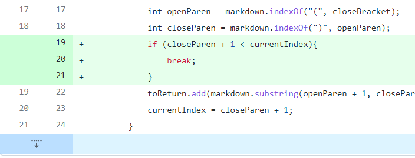
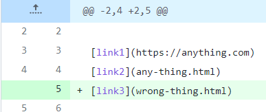
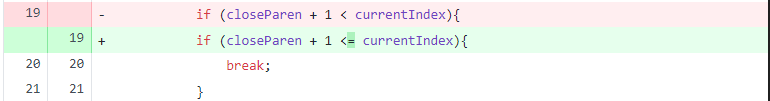
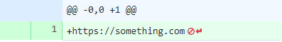
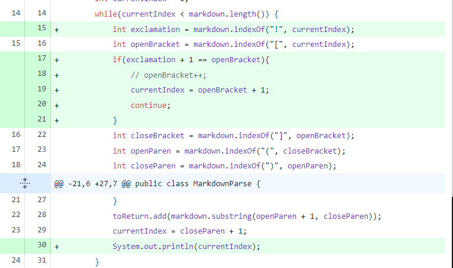
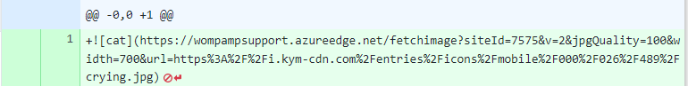
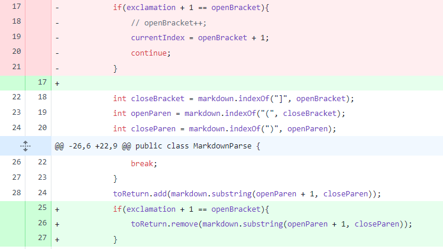

# Code change 1

## Code change diff


<!-- TODO: INSERT FROM THIS COMMIT: https://github.com/YoavGutmanUCSD/markdown-parser-2/commit/7e8ca3ec8cdb5d14ebcf8e656642d74533af4ea6 --> 


## Failure-inducing input

<!-- TODO: INSERT FROM THIS COMMIT: https://github.com/YoavGutmanUCSD/markdown-parser-2/commit/9305d47e775d33981668d02252874cfcc18df40b --> 


## Failing output

```
Exception in thread "main" java.lang.OutOfMemoryError: Java heap space
at java.base/java.util.Arrays.copyOfRange(Arrays.java:3822)
at java.base/java.lang.StringLatin1.newString(StringLatin1.java:769)
at java.base/java.lang.String.substring(String.java:2709)
at MarkdownParse.getLinks(MarkdownParse.java:19)
at MarkdownParse.main(MarkdownParse.java:30)
```

## Explanation

The loop was only breaking if closeParen was equal to the length of the text. Since it wrapped back around if nothing was found, the loop went on infinitely. 

# Code change 2

## Code change diff



## Failure-inducing input



## Failing output

```
Exception in thread "main" java.lang.StringIndexOutOfBoundsException: begin 0, end -1, length 21
at java.base/java.lang.String.checkBoundsBeginEnd(String.java:4601)
at java.base/java.lang.String.substring(String.java:2704)
at MarkdownParse.getLinks(MarkdownParse.java:22)
at MarkdownParse.main(MarkdownParse.java:33)
```

## Explanation

When nothing is found by .indexOf(), it returns -1. This should be a signal to stop, but the if statement in charge of breaking the loop used the conditional `closeParen + 1 < currentIndex`. This would never break for -1, as `0 < 0` is not a true statement.

# Code change 3

## Code change diff



## Failure-inducing input





## Failing output

```
[https://wompampsupport.azureedge.net/fetchimage?siteId=7575&v=2&jpgQuality=100&width=700&url=https%3A%2F%2Fi.kym-cdn.com%2Fentries%2Ficons%2Fmobile%2F000%2F026%2F489%2Fcrying.jpg]
```

## Explanation

We didn't add a check to see if the link was an image. It shouldn't return images, but the syntax is the same for images (barring an exclamation mark), so they have to be checked for.
