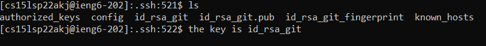
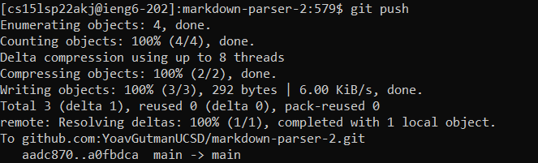
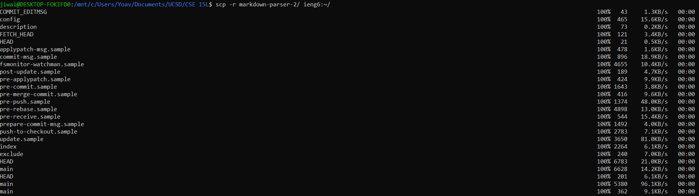
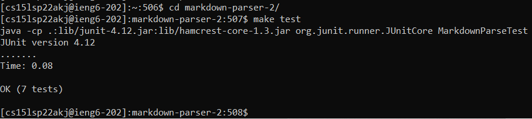
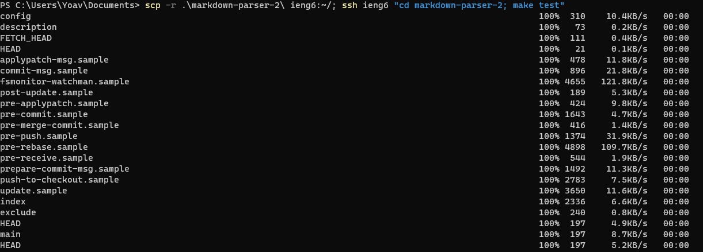
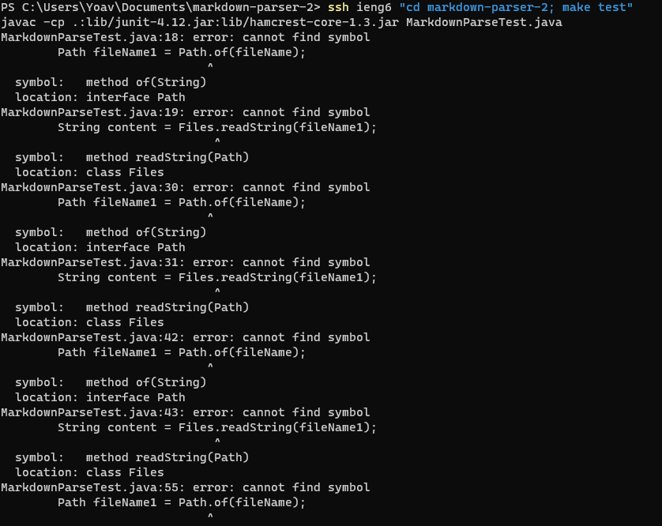

# Streamlining SSH configuration

## Show your .ssh/config file, and how you edited it (with VScode, another program, etc)

I edited it in the default wsl vim installation.

## Show the ssh command logging you into your account using just the alias you chose.

## Show an scp command copying a file to your account using just the alias you chose.

This is the `scp -r` demonstration. It shows a working usage of `scp`, however, so I chose to use it here.

# Setup Github Access from ieng6

## Show where the public key you made is stored on Github and in your user account (screenshot).

## Show where the private key you made is stored on your user account (but not its contents) as a screenshot.

## Show running git commands to commit and push a change to Github while logged into your ieng6 account.

This took me so long to troubleshoot! I did the following things to get it to work (this is for myself):

1. `eval $(ssh-agent)` to enable the next command
2. `ssh-add ~/.ssh/id_rsa_git` to add the key
4. `ssh -T git@github.com` to verify the key
3. `git remote set-url origin git@github.com:<Username>/<Project>.git` to make sure it leads to the right place

30 minutes of work!

## Show a link for the resulting commit.

[Link for the resulting commit](https://github.com/YoavGutmanUCSD/markdown-parser-2/commit/a0fbdca24ddb21c5cb9559a7150e24fe840d2efc)

# Copy whole directories using `scp -r`

## Show copying your whole markdown-parse directory to your ieng6 account.

## Show logging into your ieng6 account after doing this and compiling and running the tests for your repository.

## Show (like in the last step of the first lab) combining scp, ;, and ssh to copy the whole directory and run the tests in one line.

I was able to run the tests, but I ran into an incredibly bizarre bug that prevented me from running the tests successfully in this way. I will explain to you exactly the error I ran into, how I figured out what it was, and my proposed solution.

### Preludes

I thought to myself that this should be an easy task, and ran the following command:

`scp -r markdown-parser-2/ ieng6:~/; ssh ieng6 "cd markdown-parser-2; make test"`

This is a combination of the previous two steps, and from my knowledge of the terminal, it should have worked. There are no obvious errors here. Surely enough, the copying worked and the command generated status messages like you'd expect.

### Discovery

The makefile ran and gave me this output.

It seems like the `cd` command worked, since the makefile ran. It also seems like the `-cp` option had the intended effect, since there was no issue with detecting JUnit or bash errors. However, it seems like some of the imports failed, and nothing from Path or Files could work. This was not an issue I encountered when running `make test` during the lab or when already logged into ieng6.

My sister encountered this same exact issue when writing her lab report, so it rules out my computer as being the issue. I tried running the commands again, running them manually, using `make -C`, running a bash script instead of the makefile, and deleting any class files, to no avail.

### Cause determined?

The bash script said something about a java version mismatch. I decided to look into this more deeply. Surely enough, there was a version mismatch. The output of `ssh ieng6 "javac -version"` was "1.8.0_322", while the output of `ssh ieng6` and then `javac -version` was "javac 17.0.2". I subsequently ran the same command on my local machine to check if it were somehow using my local version, and that command *also* gave a different output.
This might be what's causing the error!

Fixing this issue is beyond my capabilities. I have an idea about what the error might be, but no idea *how* this came about, no idea how to fix it, and likely insufficient permissions to try anything as well. I will ask a TA about this issue as soon as I'm able to, but if you (the grader) could answer this one in your feedback, I would be glad. I tried my best, but I can't move further beyond this point on this task.
