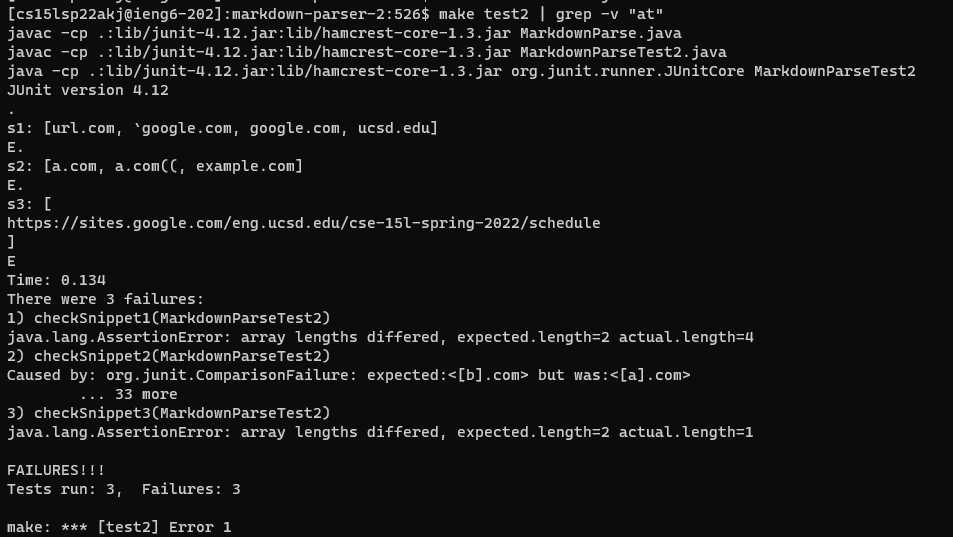
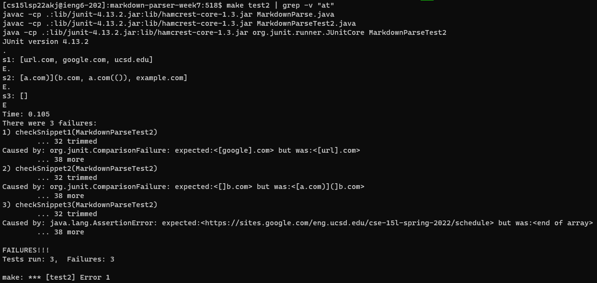

# Snippet 1

## [Ours](https://github.com/YoavGutmanUCSD/markdown-parser-2)

### Code
```
@Test
public void checkSnippet1() throws IOException{

    String fileName = "s1.md";
    Path fileName1 = Path.of(fileName);
    String content = Files.readString(fileName1);
    ArrayList<String> expected = new ArrayList<String>();
    expected.add("url.com");
    expected.add("ucsd.edu");

    assertArrayEquals(expected.toArray(), MarkdownParse.getLinks(content).toArray());
}
```

### Expected Output

An ArrayList with the following values:

1. url.com
1. ucsd.edu

### Actual output

An ArrayList with the following values:

1. url.com
1. ucsd.edu
1. google.com
1. \`google.com

### Why?

There is no logic that cares about backticks. Therefore, it will expect "\`google.com" as well. It also will expect url.com, though it should not be a valid link. This does not follow Markdown regulations.

## [Theirs](https://github.com/DanUCSD/markdown-parser.git)

### Code

```
@Test
public void checkSnippet1() throws IOException{

    String fileName = "s1.md";
    Path fileName1 = Path.of(fileName);
    String content = Files.readString(fileName1);
    ArrayList<String> expected = new ArrayList<String>();
    // expected.add("url.com");

    expected.add("google.com");
    expected.add("ucsd.edu");

    assertArrayEquals(expected.toArray(), MarkdownParse.getLinks(content).toArray());
}
```

### Expected Output

An ArrayList with the following values:

1. google.com
1. ucsd.edu

### Actual output

An ArrayList with the following values:

1. url.com
1. google.com
1. ucsd.edu

### Why?

This code checks each line to see if there is a string between brackets and an opening parentheses, then checks to see if there's a closing parentheses at the end of the line. No attention is given to backticks (the "\`" character). This does not follow Markdown regulations. 

# Snippet 2

## [Ours](https://github.com/YoavGutmanUCSD/markdown-parser-2)

### Code

```
@Test 
public void checkSnippet2() throws IOException{

    String fileName = "s2.md";
    Path fileName1 = Path.of(fileName);
    String content = Files.readString(fileName1);
    ArrayList<String>  expected=new ArrayList<String>();
    expected.add("b.com");
    expected.add("a.com(())");
    expected.add("example.com");

    ArrayList<String> actual = MarkdownParse.getLinks(content);

    System.out.format("\ns2: %s\n", toString(actual));

    assertArrayEquals(expected.toArray(), MarkdownParse.getLinks(content).toArray());
}
```

### Expected Output

An ArrayList with the following values:

1. b.com
1. a.com(())
1. example.com

### Actual output

An ArrayList with the following values:
1. a.com
1. a.com((
1. example.com

### Why?

I think this is because our code gets the first index of the characters '[', ']', '(', and ')'. I believe it means that the code sees this string as effectively the same as the first line: "[a \[nested link](a.com)".
It also does not count parentheses and stops reading at the first instance of closing parentheses on the second link. 

## [Theirs](https://github.com/DanUCSD/markdown-parser.git)

### Code

```
@Test 
public void checkSnippet2() throws IOException{

    String fileName = "s2.md";
    Path fileName1 = Path.of(fileName);
    String content = Files.readString(fileName1);
    ArrayList<String>  expected=new ArrayList<String>();
    expected.add("b.com");
    expected.add("a.com(())");
    expected.add("example.com");

    ArrayList<String> actual = MarkdownParse.getLinks(content);

    System.out.format("\ns2: %s\n", toString(actual));

    assertArrayEquals(expected.toArray(), MarkdownParse.getLinks(content).toArray());
}
```

### Expected Output

An ArrayList with the following values:

1. b.com
1. a.com(())

### Actual output

An ArrayList with the following values:

1. a.com)](b.com
1. example.com
1. a.com(())

### Why?

The code checks for string within brackets, then for the string between the first opening parentheses and the last character on the line (if it is a closing parentheses). In the case of the first link, the first opening parentheses is the one that encircles "a.com", and the last one is the one enclosing "b.com". That is what creates the weirdness.

# Snippet 3

## [Ours](https://github.com/YoavGutmanUCSD/markdown-parser-2)

### Code

```
    @Test
    public void checkSnippet3() throws IOException{

        String fileName = "s3.md";
        Path fileName1 = Path.of(fileName);
        String content = Files.readString(fileName1);
        ArrayList<String>  expected=new ArrayList<String>();
        expected.add("https://sites.google.com/eng.ucsd.edu/cse-15l-spring-2022/schedule");
        expected.add("https://www.twitter.com");

        ArrayList<String> actual = MarkdownParse.getLinks(content);

        System.out.format("\ns3: %s\n", toString(actual));

        assertArrayEquals(expected.toArray(), MarkdownParse.getLinks(content).toArray());
    }
```

### Expected Output

An ArrayList with the following values: 

1. https://www.twitter.com
1. https://sites.google.com/eng.ucsd.edu/cse-15l-spring-2022/schedule

### Actual output

An ArrayList with the following values: 

1. https://sites.google.com/eng.ucsd.edu/cse-15l-spring-2022/schedule (surrounded by newlines)


### Why?

It should read the text between parentheses correctly, and to its credit, that is what happens for the second link. However, it seems to struggle with line breaks. Our code removes a link from the returnable list if it matches a certain condition (made to handle images), but I think it might be overzealous. We had a similar issue in the past, but thought we fixed it.

## [Theirs](https://github.com/DanUCSD/markdown-parser.git)

### Code

```
@Test
public void checkSnippet3() throws IOException{

    String fileName = "s3.md";
    Path fileName1 = Path.of(fileName);
    String content = Files.readString(fileName1);
    ArrayList<String>  expected=new ArrayList<String>();
    ArrayList<String> actual = MarkdownParse.getLinks(content);

    System.out.format("\ns3: %s\n", toString(actual));
    expected.add("https://sites.google.com/eng.ucsd.edu/cse-15l-spring-2022/schedule");
    expected.add("https://www.twitter.com");


    assertArrayEquals(expected.toArray(), MarkdownParse.getLinks(content).toArray());
}
```

### Expected Output

An ArrayList with the following values:

1. https://www.twitter.com
1. https://sites.google.com/eng.ucsd.edu/cse-15l-spring-2022/schedule

### Actual output

Nothing.

### Why?

The code does not detect valid links if their closing parentheses are at the end of the line, and does not support multiline links. Therefore, it finds nothing here.

# Questions

## Do you think there is a small (<10 lines) code change that will make your program work for snippet 1 and all related cases that use inline code with backticks?

I think there is a way. Since everything within backticks would not be counted towards the identification of a link, you could just remove them entirely. I would write a function to remove everything including and between backticks.

## Do you think there is a small (<10 lines) code change that will make your program work for snippet 2 and all related cases that nest parentheses, brackets, and escaped brackets?

I think there is a way, but it would be more involved. There would need to be new checks for the following situations:

1. nested parentheses
1. brackets
1. escaped brackets

For 1 and 2, you would need two new functions to give the index of the closing bracket or parentheses respectively in order to abide by clean coding standards. You would have to include logic to ignore escaped characters, which would have to run on each bracket or parentheses. In total, each function would require three variable definitions, a while loop with logic that increments a variable for open or closed parentheses, and logic to account for escaped characters. Easily, this would pass 10 lines.


## Do you think there is a small (<10 lines) code change that will make your program work for snippet 3 and all related cases that have newlines in brackets and parentheses?

I think there is a way. You could simply remove every instance of newline between open and closed parentheses. As far as I know, there can be multiline links so long as the link itself isn't divided between the first line and the rest of the lines. (First 2 in snippet 3 are valid, others are not). This could be implemented using an if statement, which should be an ordeal of 3 lines.

# Makefile screenshots

## Ours



## Theirs


